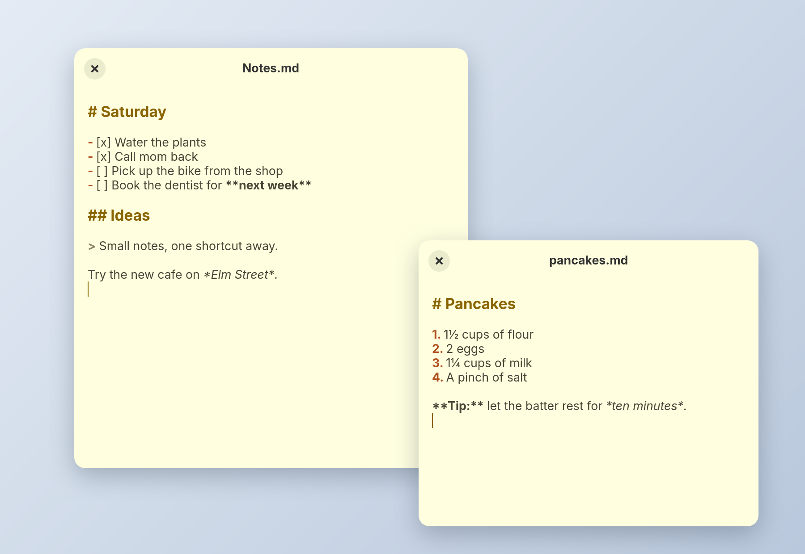

# Pad

The simplest note taking app: one sticky note on your desktop, saved as you type. GTK 4 and Vala. Formerly elementary-notes.

  

- Your default note, or any file with `pad README.md`. Markdown reads like a note, other files get highlighting for their language, all with smart indentation.
- Saved half a second after you stop typing, at least every five seconds while you keep going, and when you switch away or close it.
- Opens as a floating note on GNOME, elementary and niri, each file at the size you last left it. On X11 sessions it also returns to where you left it; Wayland desktops place windows themselves.
- Offline, no accounts, no tracking.

## Using it

    pad               open the default note
    pad README.md     open README.md, saved as you type
    pad a.md b.md     one window per file

Relative paths work from any folder, and a file that is already open comes to the front instead of opening twice. A file that doesn't exist yet is created when you start typing.

The default note lives in `~/.local/share/pad/Notes.md`. To keep it somewhere else, like a synced folder:

    gsettings set io.github.mariocesar.Pad note-file '~/Dropbox/Notes/Notes.md'

It takes effect the next time Pad opens. `gsettings reset io.github.mariocesar.Pad note-file` goes back to the default.

## Install

You need Meson, Vala, GTK 4.20 or newer and GtkSourceView 5.

    meson setup build
    meson compile -C build
    sudo meson install -C build

Or `just install` to install into `~/.local`.

## Develop

    just run
    just test

## License

GPL-3.0-or-later, see [LICENSE](LICENSE).
