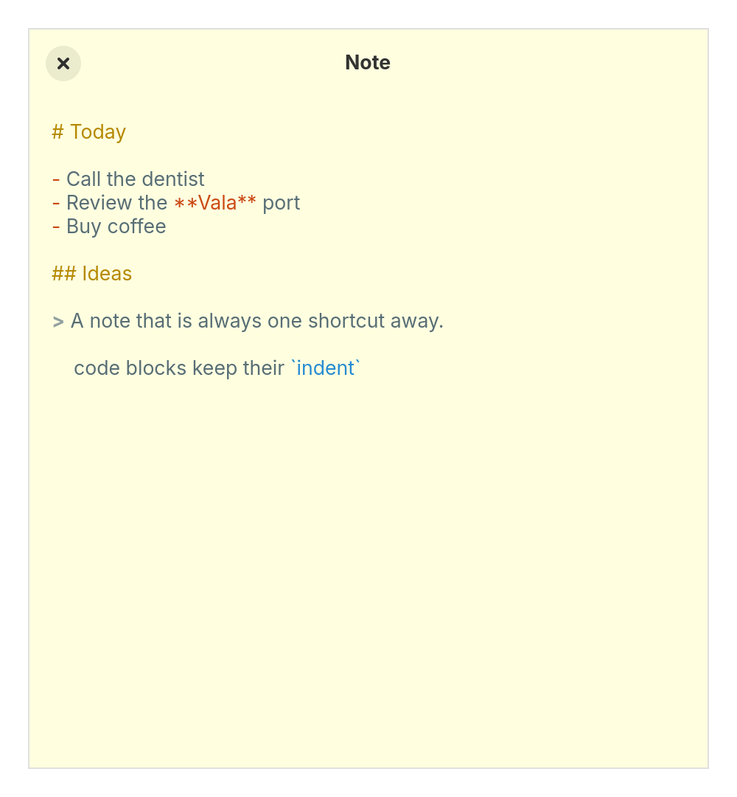

# Notes

The simplest note taking app: one sticky note on your desktop, saved as you type. GTK 4 and Vala.

  

- One note, one Markdown file, with Markdown highlighting and smart indentation.
- Saved half a second after you stop typing, and when you close the window.
- A floating window at a fixed note size, on GNOME, elementary and niri.
- Offline, no accounts, no tracking.

The note lives in `~/.local/share/notes/Notes.md`. To keep it in a synced folder, replace that file with a symlink; Notes writes through it.

## Install

You need Meson, Vala, GTK 4.20 or newer and GtkSourceView 5.

    meson setup build
    meson compile -C build
    sudo meson install -C build

Or `just install` to install into `~/.local`.

## Develop

    just run
    just test

## License

GPL-3.0-or-later, see [LICENSE](LICENSE).
